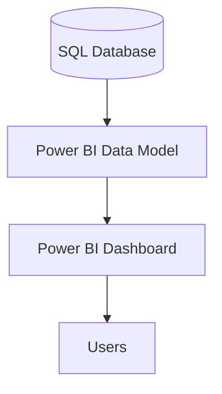
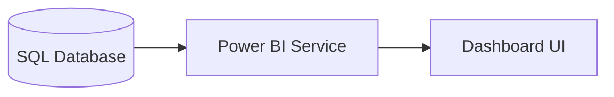
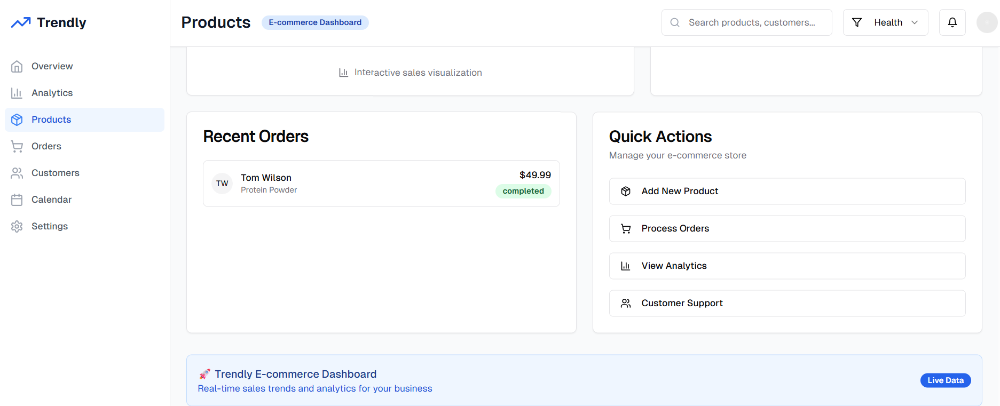
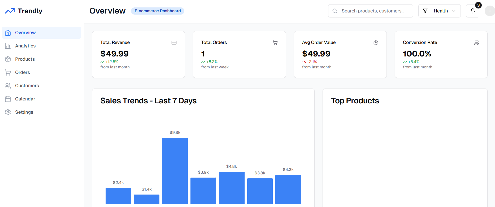

[](LICENSE)
[](https://github.com/your-username/trendly-ecommerce-visualizer/stargazers)

╔══════════════════════════════════════════════════
══════╗  ║             🚀 Welcome to Trendly Dashboard!           ║
╚══════════════════════════════════════════════════ 
══════╝

# Trendly – E-commerce Sales Trends Visualizer

*A Power BI dashboard that visualizes sales trends, top products, and customer segments for an e-commerce business.*

---

## 📖 Table of Contents

1. [✨ Features](#✨-features)
2. [📋 Product Requirements](#📋-product-requirements)
3. [🗺️ High-Level Design](#🗺️-high-level-design)
4. [⚙️ Low-Level Design](#⚙️-low-level-design)
5. [🚀 Getting Started](#🚀-getting-started)
6. [🤝 Contributing](#🤝-contributing)
7. [📜 License](#📜-license)

---

## ✨ Features

* **Sales Trend Analysis**: Daily, weekly, and monthly line/bar charts.
* **Top Products**: Ranking by revenue and quantity sold.
* **Customer Segmentation**: Pie/bar charts by demographics and behavior.
* **Interactive Filters**: Date range, product category, customer segment slicers.

---

## 📋 Product Requirements

**Objectives & Stakeholders**

| Objective                                    | Stakeholder    |
| -------------------------------------------- | -------------- |
| Visualize sales performance (daily, monthly) | Business Users |
| Highlight best-selling products              | Product Owner  |
| Segment customers by demographics            | BI Developer   |
| Provide actionable insights                  | Data Engineer  |

**Functional & Non-Functional Requirements**

| Category           | Requirement                                              |
| ------------------ | -------------------------------------------------------- |
| Data Integration   | - Import sales, product, customer data from SQL Database |
|                    | - Daily scheduled refresh                                |
| Dashboard Features | - Trend charts (line/bar)                                |
|                    | - Top products view (table/bar)                          |
|                    | - Customer segmentation visuals (pie/bar)                |
|                    | - Interactive filters/slicers                            |
| KPIs               | - Total Sales, Average Order Value, Customer Count       |
| Performance        | Dashboard loads < 5s                                     |
| Security           | Role-based access control                                |
| Usability          | Intuitive layout, responsive                             |
| Data Freshness     | Updated daily                                            |

**Data Model**

| Table     | Key Fields                                  | Relationships                      |
| --------- | ------------------------------------------- | ---------------------------------- |
| Sales     | SaleID, Date, ProductID, CustomerID, Amount | → Product(ProductID), Customer(ID) |
| Products  | ProductID, Name, Category                   | ← Sales(ProductID)                 |
| Customers | CustomerID, Name, Age, Location             | ← Sales(CustomerID)                |

**User Stories & Acceptance**

| User Story                                        | Acceptance Criteria                         |
| ------------------------------------------------- | ------------------------------------------- |
| As a Business User, view sales trends over time   | Accurate, up-to-date visuals                |
| As a Business User, identify top-selling products | Top 10 products correctly ranked            |
| As a Business User, analyze customer segments     | Segments by demographics rendered correctly |

---

## 🗺️ High-Level Design

**System Architecture**



**Deployment Diagram**



\---------------------|------------------------------|------------------------------------------------------|
\| Data Storage        | MS SQL Server                | Source of transactional sales, product, customer data |
\| BI & Visualization  | Power BI Desktop/Service     | Dashboard creation and publishing                    |
\| Data Modeling & DAX | Power BI Data Model, DAX     | Measures, calculated columns                         |
\| Security            | Power BI RLS, Credentials    | Role-level security and data access                  |

---

## ⚙️ Low-Level Design

**Components & Measures**

| Component           | Description                                                                          |
| ------------------- | ------------------------------------------------------------------------------------ |
| Data Import Layer   | Power BI SQL Connector: extracts tables, defines relationships                       |
| Data Model Layer    | Power BI tables & relationships                                                      |
| DAX Calculation     | - `TotalSales = SUM(Sales[Amount])`                                                  |
|                     | - `TopProducts = TOPN(10, VALUES(Product[ProductName]), [TotalSales], DESC)`         |
|                     | - `SalesTrend = CALCULATE([TotalSales], GROUPBY(Sales, Sales[OrderDate]))`           |
|                     | - `CustomerSegments = SUMMARIZE(Customer, Customer[Segment], "Sales", [TotalSales])` |
| Visualization Layer | Line, Bar, Pie charts; slicers and KPIs                                              |

**Error Handling**

| Scenario               | Handling                            |
| ---------------------- | ----------------------------------- |
| SQL connection failure | Error message, retry option         |
| Schema mismatch        | Log error, notify dashboard owner   |
| DAX calculation error  | Show fallback visuals, log details  |
| Missing data           | Display "No Data Available" message |

---

## 🚀 Getting Started

1. **Clone the repo**

   ```bash
   git clone https://github.com/your-username/trendly-ecommerce-visualizer.git
   cd trendly-ecommerce-visualizer
   ```
2. **Open Power BI Desktop** and load `Trendly.pbix` located in the repo root.
3. **Configure Data Source**: Transform Data → Data source settings → Update connection details.
4. **Refresh Data**: Home → Refresh (or schedule in Power BI Service).

**Screenshots & Demo**


*Sales trend over time*


*Top products and customer segments*

<video src="video/demo.mp4" controls width="600">
  Your browser does not support the video tag.
</video>

---

## 🤝 Contributing

1. Fork this repository.
2. Create a feature branch: `git checkout -b feature/XYZ`.
3. Commit your changes: `git commit -m "Add feature XYZ"`.
4. Push and create a Pull Request.

---

## 📜 License

This project is licensed under the [MIT License](LICENSE).
